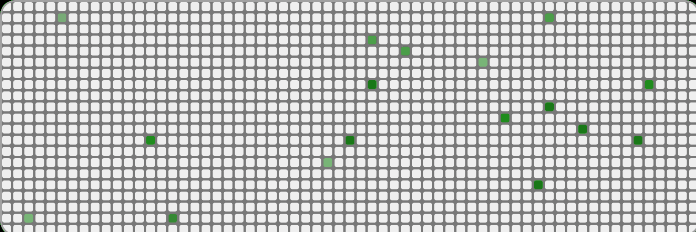

                          
# Open Source Firmware

## 🌐 About Us
We design, build, and ship high-quality hardware boards and sensor modules, paired with intelligent data and automation workflows.

🌍 **Website:** [sintropy.ai](https://sintropy.ai)  
💼 **LinkedIn:** [SINTROPY.AI](https://www.linkedin.com/company/sintropy-ai/)

Our open-source initiative aims to make the firmware powering our boards transparent, reliable, and fully customizable by the community.

## 🔧 What We Open-Source
We will soon begin releasing the firmware of the hardware products we manufacture.  
**Firmware repositories are coming soon.**  
Each repo will include:
- Source code  
- Build instructions  
- Flashing guides  
- Example projects & integrations  

## 🚀 Getting Started
1. Browse the public repositories in our organization.  
2. Select the board or module you are working with.  
3. Follow the README, setup steps, and examples provided in each repo.  

## 🤝 Contributing
Contributions are welcome!  
Please check each project’s:
- `CONTRIBUTING.md`  
- The **Issues** section for tasks, ideas, bugs, and contribution opportunities.

Feel free to open new issues, comment on existing ones, or fork the repository and submit a pull request.

## 📄 License
All firmware will be released under the license specified in each repository .

## 📬 Contact Us
For inquiries, collaborations or support:

- 💌 Email: [sintropy-team@sintropy.ai](mailto:sintropy-team@sintropy.ai)
